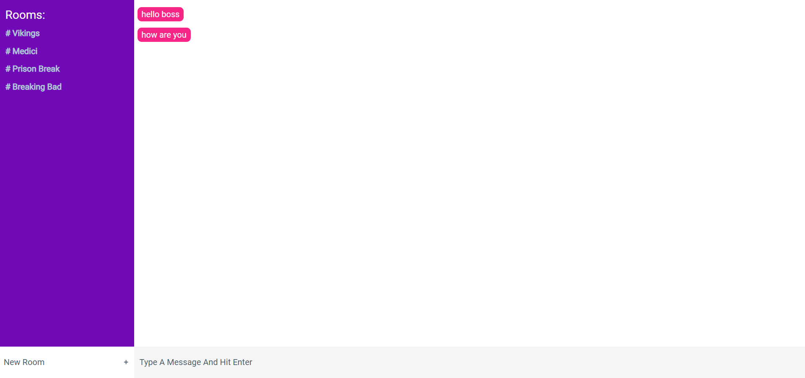
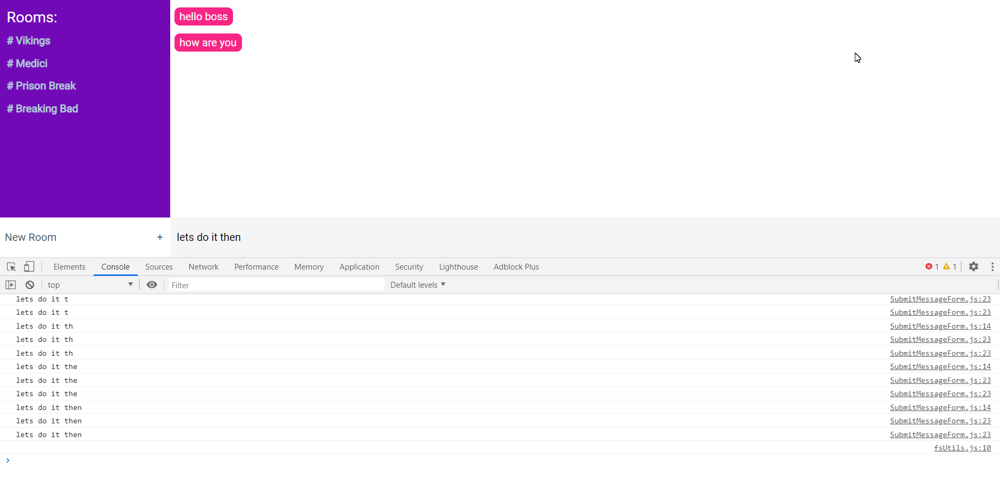

## Motivation & Story
Trying to learn react,this is a running commentary of me building chatflix using React & Ably.Chatflix is a place to talk about your favorite neflix shows. The project uses React & Ably's pub/sub capabilities for realtime communication .

## Final Product we are aiming at
The final product we are building in the first version will be a very simple one.Ability to chat into any room(shows) of your choice.One nice feature we will be trying to add in the first version is the ability to react to any particular chat message.
Due to lack of time we will not be adding any database or server side logic as of now.So we will be using Ably's persist message capability to store all of our chat messages as of now for 24-72 hours.Later we might use Django & Postgres.Images of final product will be updated here everytime we reach one milestone of our development.


## Step 1 -Create a new react app & figure out all the components in our App
```python
npm install -g create-react-app  #If you don't have react installed on your computer
npx create-react-app chatflix #your fresh  new application
cd chatflix #now we are inside chatflix
npm start #fireup the server
```
Since react is all about breaking webpages into components, lets figure out the components we will be needing ,we might break them up further if required. So inside **App.js**

**RoomList** to show us all the rooms/shows we can join
**MessageList**  the actual messaging area
**CreateRoom**  the ability to create new rooms for new shows
**SubmitMessageForm** the chat submit area

I added the css styles and the ably installations which were pretty easy to do yourself, so no explanation here.

The code until [Step 1](https://github.com/ashishkr619/chatflix/tree/bfe8e851268c3e4fcc927571299ed635b9e4987f)

## Step 2 - Let's start with the MessageList component

MessageList(or the actual messaging area).To build MessageList we will need to send messages from **App.js** down to the **MessageList Component**.To do so we will use props,

```
<MessageList messages={this.state.messages}/> // in the App.js
```

Down in the Messagelist component **MessageList.js** we receive the list of all messages from **App.JS**, break them down one by one using map function and further send individual message to **Message** component
```
<div className='message-list'>
                {this.props.messages.map((message, i) => (
					<Message key={i} message={message} />
				))}
</div>
```
Inside **Message.js**
just receive the props and display them
```
...
        return(
            <div className='message'>
                <div className='message-text' key={this.props.key}>{this.props.message}</div>
            </div>
...

```
Let's send some random messages from **App.js** to verify our working

```
...
 constructor(){
    super()
    this.state={
      messages:['hello boss','how are you'], // all the messages
      rooms:[], // all the rooms

    }
  }
...
```


The code until [Step 2](https://github.com/ashishkr619/chatflix/tree/825a4147ffc9a827f9268bf20c0eb0e2e2533912)

## Step 3- The SubmitMessgeForm component
Form elements have their own internal states based upon user inputs(eg:when i type something the element needs to keep a track of what i am typing),but since we already know that we want to keep the internal state of an element in this.state,and if we would rather control the content of a component , in the component's state we get a single source of truth and the application becomes less prone to bugs. So let's take whatever the user inputs and store them into the this.state

Inside **SubmitMessgeForm.js** 
We listen to whatever user types by adding onChange event listener to our form component, and then update state via the handleChange method.

```
...
class SubmitMessageForm extends Component {
	constructor(props){
	super(props)
	this.state ={
		message :''
	}
	this.handleChange = this.handleChange.bind(this)//binds the handleChange to a component's instance

	}
	
	handleChange(e){
		this.setState({
			message :e.target.value

		})

	}

	render() {
		console.log(this.state.message)// this confirms that we are now getting form data via this.state,so we can use it anyhow we want,lets use this to update value of the input field
		return (
			<form className="send-message-form">
				<input
					type="text"
					onChange={this.handleChange}
                    value={this.state.message}
					placeholder="type a message and hit Enter..."
				/>
			</form>
		);
	}
}

...

```

Finally we add onSubmit to our form element to submit our message 

```
...
	handleSubmit(e){
		e.preventDefault()
		console.log(this.state.message)
		//connect to ably and send the actual message(this.state.message) in next step

	}

...

```


The code until [Step 3](https://github.com/ashishkr619/chatflix/tree/825a4147ffc9a827f9268bf20c0eb0e2e2533912)